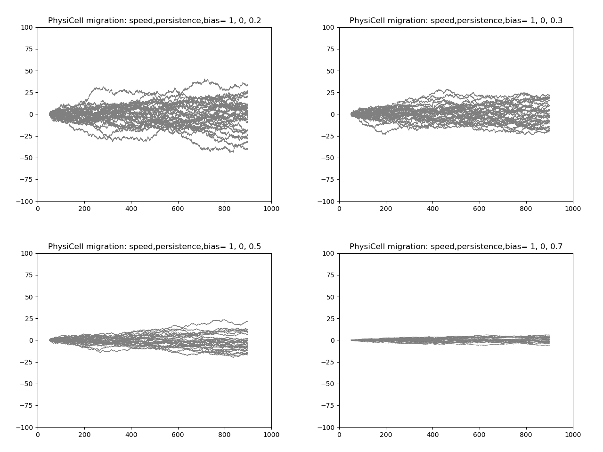
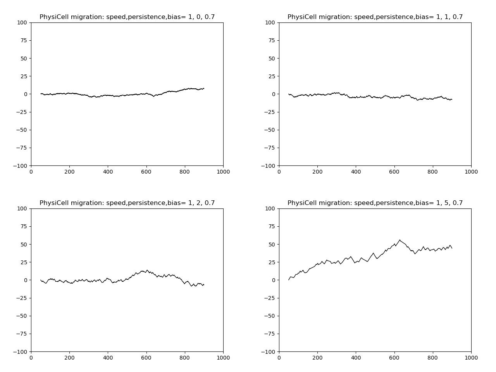
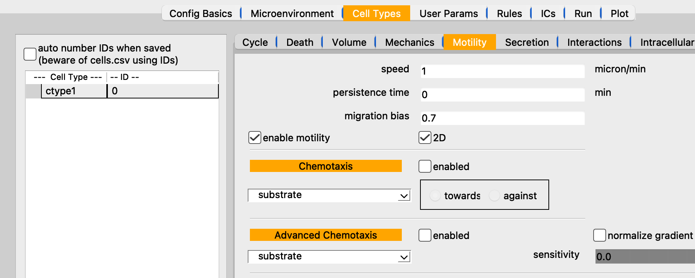

## Persistent Random Walk / Biased Motility reference model

*Brief description*: a single cell moves horizontally (motility vector= (1,0,0)) across a 
2D domain and stops when it reaches a certain x-value. Movement can be random with a specified
bias [0,1], where 0=random movement; 1=perfectly horizontal movement.

### PhysiCell: biased motility

* Showing 30 replicates on each frame. Stochasticity of replicates is due to randomly seeding the PRNG.
* PhysiCell has 3 parameters that are key to defining a cell type's motility: speed, persistence time, and migration bias.
* The `migration_bias_direction` (motility vector) is hard-coded as (1,0,0) in C++ for this model
 
<table>
  <tr>
    <td> </td>
   </tr> 
</table>

* The following figure shows how changing just the persistence time affects results. Here, we leave
two parameters fixed: speed= 1 and bias= 0.7 (and motility vector still (1,0,0)), but vary persistence time: 0, 1, 2, and 5. The same PRNG seed is used for each simulation.

 

 
The Motility parameters as shown in PhysiCell Studio. However, for the replicates shown above, the Studio was not used; rather, a custom `main.cpp` and `custom.cpp` were used to generate the cell paths, from the command line.

