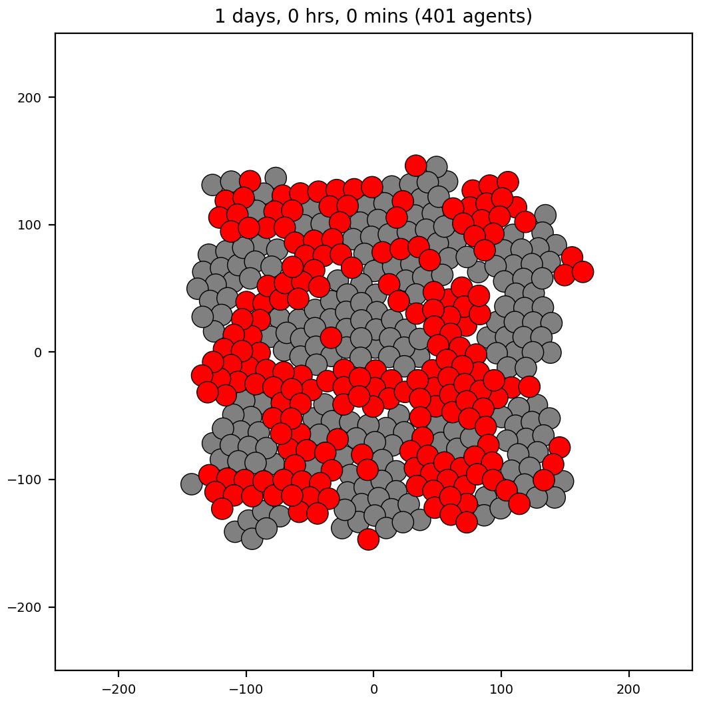

## Cell sorting reference model

*Brief description*: cell sorting using differential cell adhesion is a well known model made popular in (citations). Here, we demonstrate results using both PhysiCell and Morpheus. There are different model sizes and initial conditions of cells. First, we show results using a small model size of 51 cells (and two cell types) and three different initial conditions: 1) split top-bottom, 2) checkerboard, and 3) random. 
Then we show a larger model size of 401 cells (two cell types) with a random arrangement.

Note that we used scripts developed for the OpenVT project to convert the initial conditions (ICs) of cells from one framework (PhysiCell) into another (Morpheus). This enables us to start simulations with the same ICs in order to check qualitative reproducibility of results.

### Small, "unit tests" for cell sorting
<table>
  <tr>
    <td>----------------  PhysiCell  ----------</td><td>----------------  Morpheus  ----------</td>
   </tr> 
  <tr>
    <td> </td>
    <td> </td>
   </tr> 
   <tr>
     <td> </td>
     <td> </td>
   </tr>
   <tr>
     <td> </td>
     <td> </td>
   </tr>
</table>

### PhysiCell: larger model for cell sorting
The initial cell positions are an approximation to those in [Figure 2 of this Chaste 2017 paper](https://journals.plos.org/ploscompbiol/article/figure?id=10.1371/journal.pcbi.1005387.g002) from the "OS" (Overlapping Spheres) row.
<table>
  <tr>
    <td> </td>
    <td></td>
   </tr> 
   <tr>
      <td></td>
      <td></td>
  </tr>
</table>
Results using rules to increase cell-cell repulsion if there is too much pressure on a cell.

  
<table>
  <tr>
    <td> </td>
    <td></td>
   </tr> 
   <tr>
      <td></td>
      <td></td>
  </tr>
</table>
Results with no rules.

We also provide an analysis script
that determines the number of clusters (connected components of a graph) of each cell type:
<pre>
(base) M1P~/git/OpenVT/playground/PhysiCell/models$ python ctypes_graph.py output_csort_ics_2017
# args= 2
out_dir=  output_csort_ics_2017
----- finding clusters for frame #  720
# cells=  401
time (min)=  43200.0

------ cell_type =  0
len(id_ctype)=  207
# of clusters for cell type 0 = 6

------ cell_type =  1
len(id_ctype)=  194
missing (isolated) cell ids= {395}
# of clusters for cell type 1 = 6
</pre>

