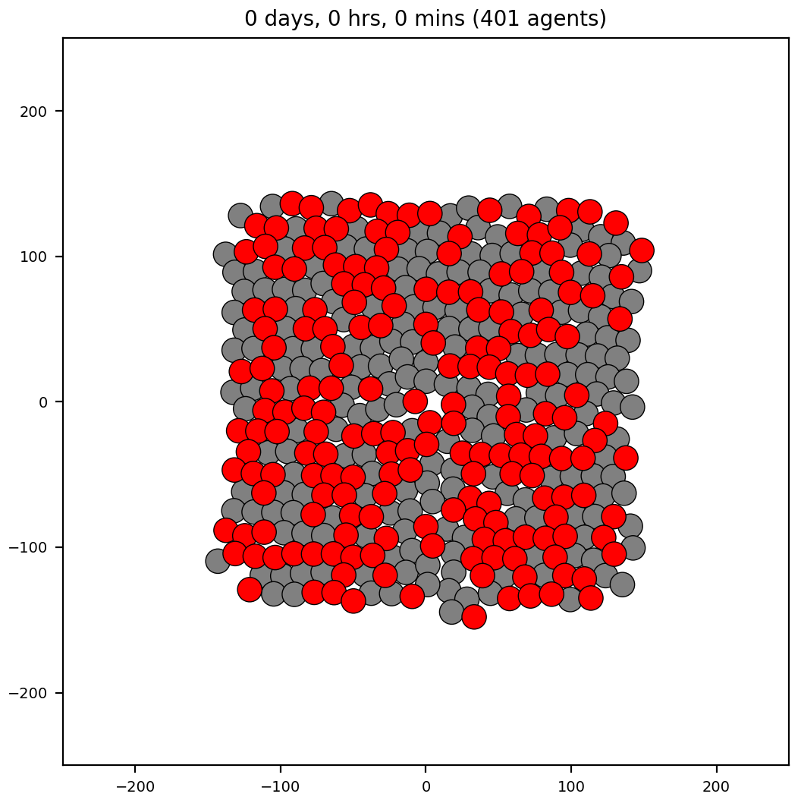

*Brief description*: cell sorting using differential cell adhesion is a well known model made popular in (citations). Here, we demonstrate results using both PhysiCell and Morpheus. There are different model sizes and initial conditions of cells. First, we show results using a small model size of 51 cells (and two cell types) and three different initial conditions: 1) split top-bottom, 2) checkerboard, and 3) random. Then we show a larger model size of 401 cells (two cell types) arranged randomly that approximate the initial conditions for the "Ovelapping Spheres" simulation shown in Figure X of citation (Chaste 2017).

Note that we used scripts developed for the OpenVT project to convert the initial conditions (ICs) of cells from one framework (PhysiCell) into another (Morpheus). This enables us to start simulations with the same ICs in order to check qualitative reproducibility of results.

### Cell sorting on small, baseline models using PhysiCell
<table>
  <tr>
    <td> </td>
   </tr> 
   <tr>
     <td> </td>
   </tr>
   <tr>
     <td> </td>
   </tr>
</table>

### Cell sorting on small, baseline models using Morpheus
<table>
  <tr>
    <td> </td>
   </tr> 
   <tr>
     <td> </td>
   </tr>
   <tr>
     <td> </td>
   </tr>
</table>

### Cell sorting on a larger model using PhysiCell
The initial cell positions are an approximation to those in [Figure 2 of this Chaste 2017 paper](https://journals.plos.org/ploscompbiol/article/figure?id=10.1371/journal.pcbi.1005387.g002) from the "OS" (Overlapping Spheres) row.
<table>
  <tr>
    <td> </td>
    <td></td>
   </tr> 
   <tr>
      <td></td>
      <td></td>
  </tr>
</table>

