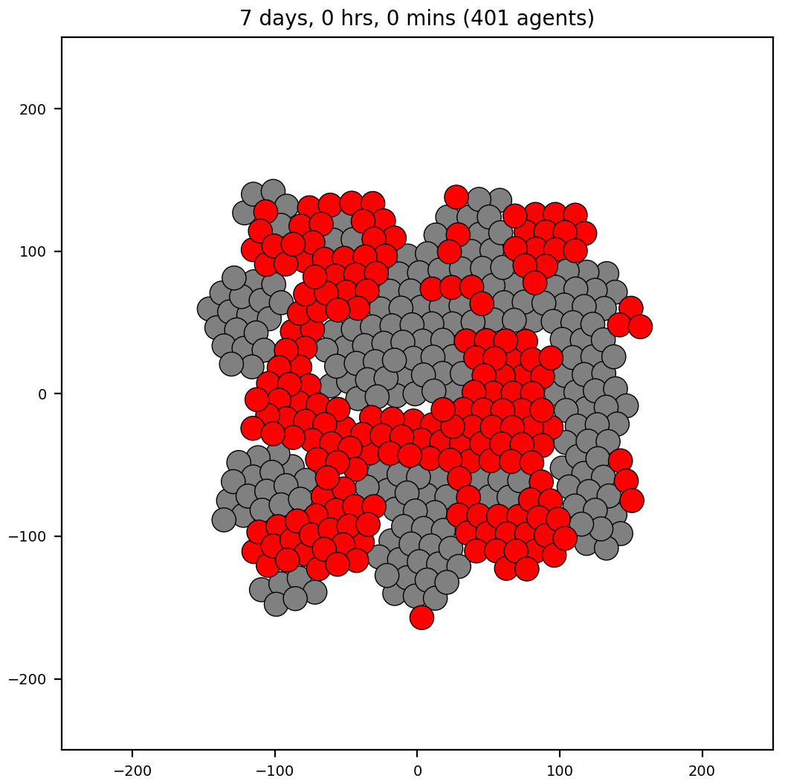
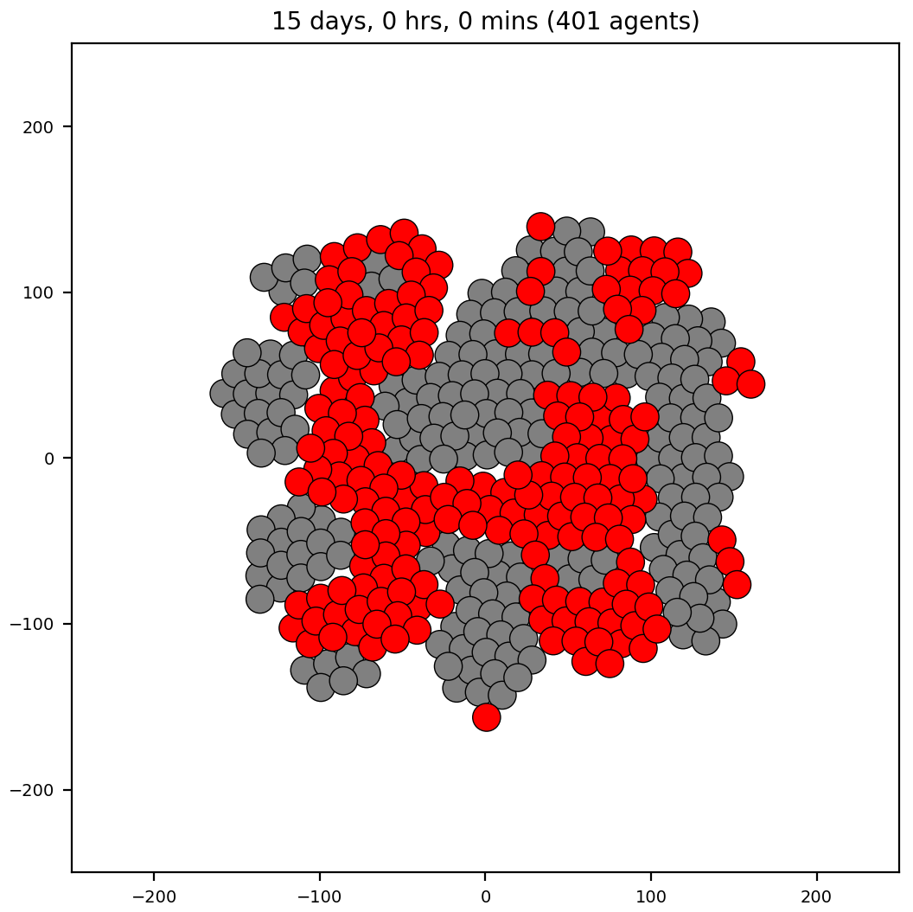

*Brief description*: cell sorting using differential cell adhesion is a well known model made popular in (citations). Here, we demonstrate results using both PhysiCell and Morpheus. There are different model sizes and initial conditions of cells. First, we show results using a small model size of 51 cells (and two cell types) and three different initial conditions: 1) split top-bottom, 2) checkerboard, and 3) random. Then we show a larger model size of 401 cells (two cell types) arranged randomly that approximate the initial conditions for the "Ovelapping Spheres" simulation shown in Figure X of citation (Chaste 2017).

### Cell sorting on small models using PhysiCell
<table>
  <tr>
    <td> </td>
   </tr> 
   <tr>
     <td> </td>
   </tr>
   <tr>
     <td> </td>
   </tr>
</table>

### Cell sorting on small models using Morpheus
<table>
  <tr>
    <td> </td>
   </tr> 
   <tr>
     <td> </td>
   </tr>
   <tr>
     <td> </td>
   </tr>
</table>

### Cell sorting on larger model using PhysiCell
The initial cell positions are an approximation to those in the Chaste 2017 paper.
<table>
  <tr>
    <td> </td>
    <td></td>
   </tr> 
   <tr>
      <td></td>
      <td></td>
  </tr>
</table>

