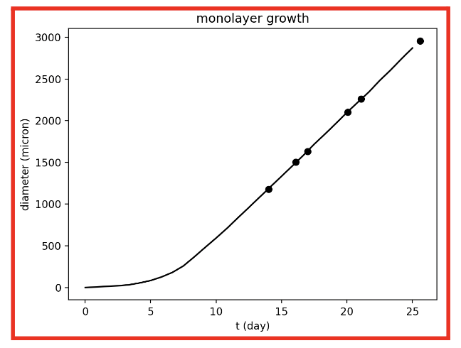
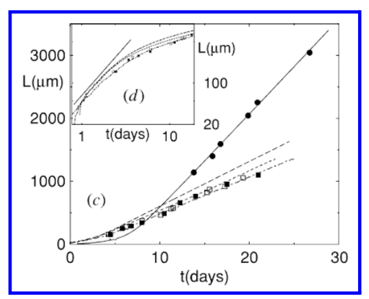
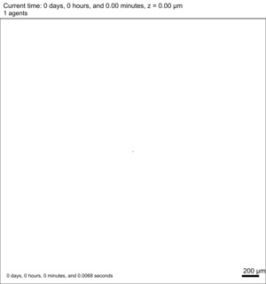

*Brief description*: A single cell (in the center of a 2D domain) undergoes division, resulting in a growing circular monolayer of cells. The only forces are repulsive - cells nudge away their neighbor cells. There are no signals in the microenvironment, so no cell chemotaxis, etc.. Cells do not undergo motility either; they are only “motile” due to the cell-cell repulsive forces.

### Growing monolayer model using PhysiCell
<table>
  <tr>
    <td> </td>
     <td> </td>
   </tr>
</table>

<table>
  <tr>
    <td> </td>
   </tr>
</table>
